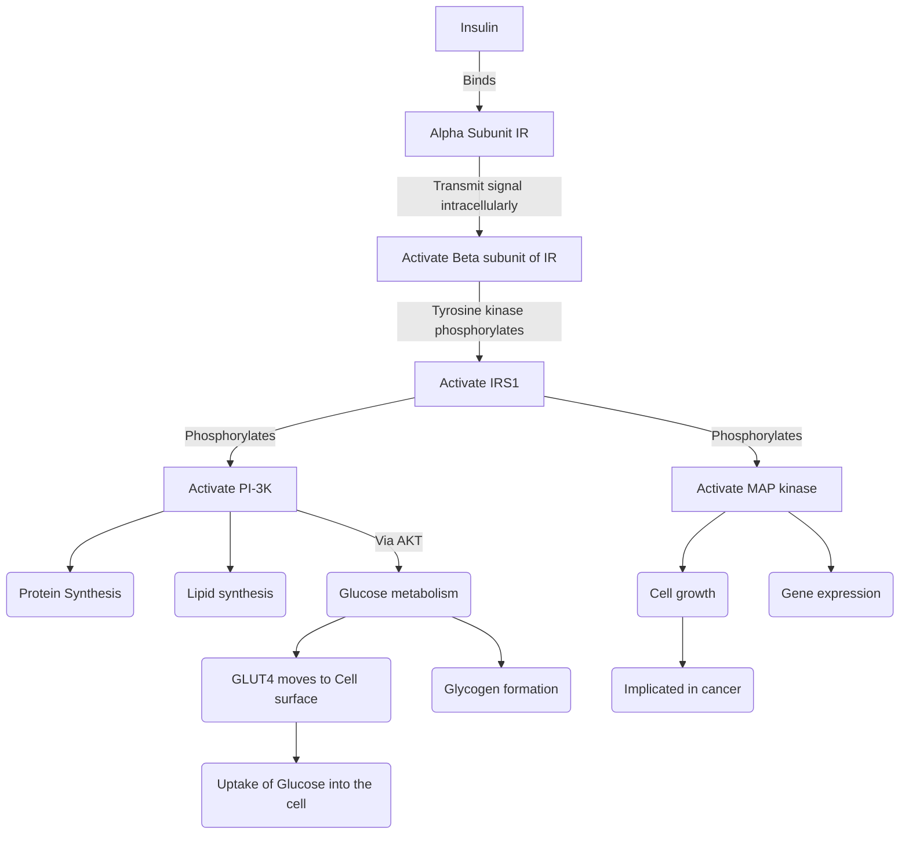
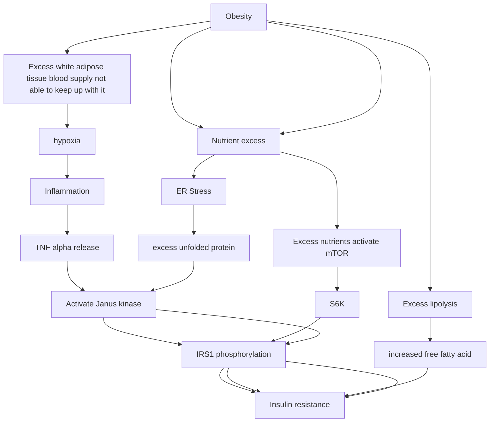

---
{"dg-publish":true,"permalink":"/notes-in-endocrinology/diabetes/pathogenesis-of-type-2-diabetes/insulin-resistance/2-0-mechanisms-for-insulin-resistance/"}
---

- Credits
    - Section Writer: [[About Us/Dr. Om J Lakhani\|Dr. Om J Lakhani]]
    - Section Editor: [[About Us/Dr. Om J Lakhani\|Dr. Om J Lakhani]]


- Linked notes
    - [[Insulin resistance: Introduction, Definition and Quantification\|Insulin resistance: Introduction, Definition and Quantification]]
 
- Q. Describe the Insulin siganlling pathway ?
	- Please see this video that describes the insulin signal transduction beautifully
        <iframe width="560" height="315" src="https://www.youtube.com/embed/DcIEEiGLtVU" title="YouTube video player" frameborder="0" allow="accelerometer; autoplay; clipboard-write; encrypted-media; gyroscope; picture-in-picture" allowfullscreen></iframe>



	
				
	


- Q. Describe the components that impact insulin resistance ?
    - Nutrient excess
    - Lack of exercise
    - Inflammation
    - Excess free fatty acid
    - Intramyocellular lipids
    - Mitochondrial dysfunction
    - Glucocorticoids
    - Sleep
    - Human placental lactogen


- Q. How does mTOR lead to insulin resistance ?
    
	```mermaid
	graph LR
		A[Excess nutrients activate mTOR] --> B[S6K] --> C[phosphorylation of IRS1] --> D[Insulin resistance]
	```
          
- Q. What is the role of AMPK in this ?
    ```mermaid
	graph LR
	A[Exercise and metformin] --> B[increase AMPK inhibition of mTOR] --> C[reduces insulin resistance]
	```
- Q. What is unfolded protein response ?
    ```mermaid
	graph LR
	 A[Excess nutrients] --> B[ER Stress] --> C[excess unfolded protein] --> D[Janus kinase activiated] --> E[IRS1 phosphorylation] --> F[insulin resistance]
	 ````
    - To know more about Unfolded protein response and ER stress please see our video on this topic
		- <iframe width="560" height="315" src="https://www.youtube.com/embed/zm6M4MWA1os" title="YouTube video player" frameborder="0" allow="accelerometer; autoplay; clipboard-write; encrypted-media; gyroscope; picture-in-picture" allowfullscreen></iframe>

- Q. How does inflammation in adipocytes produce insulin resistance ?
     ```mermaid
	 graph LR
	 	 A[Excess white adipose tissue blood supply not able to keep up with it] --> B[hypoxia] --> C[Inflammation] --> D[TNF alpha release] --> E[Activate Janus kinase] --> F[IRS1 phosphorylation] --> G[Insulin resistance]
	 ```
	
- Q. What is the Randle cycle ?
    - Excess Free fatty acids reduces Glucose metabolism


- Q. Describe the process of lipotoxicity and Randle cycle ?
    - Randle cycle:
        ```mermaid
		graph TD
		A[Increase Free fatty acid increase oxidation of FFA] --> B[increase citrate] --> C[inhibit PFK] --> D[inhibits glucose metabolism pathway] --> E[accumulation of G6P] --> F[reduced glucose uptake by GLUT4 in muscles]
		```

- Q. How do glucocorticoids produce insulin resistance ?
    - Change in body composition → fat moves from periphery to centre
    - Increase Free fatty acid 
    - Reduction of P13K


- Q. Summarize how obesity leads to insulin resistance ?



- #Updates
    - Date: [[May 1st, 2021\|May 1st, 2021]]
    - Source: [[International Textbook of Diabetes Mellitus, 2 Volume Set, 4th Edition\|International Textbook of Diabetes Mellitus, 2 Volume Set, 4th Edition]]


- Q. Which is more likely to cause insulin resistance, Subcutenous fat or viceral fat ?
    - Viceral fat is known to produce insulin resistance 
    - Eventually ovewhelming of fat storage in subcutenous regions - leads to spillover to viceral area- leading to more fat storage and insulin resistance


- Q. Does one impact the other - i.e. if for some reason, the patient cannot store subcutenous fat, there is more ectopic fat storage ?
    - Yes
    - There is a theory that suggests that if the patient cannot store more subcutenous fat, then they store ectopic fat and vice versa
    - This phenomenon is seen in lipodystrophic syndrome
    - It is also seen in Sumo wrestlers who are having more subcutenous and less ectopic fat and hence are more healthy
    - South-Asians have more viceral fat and have less ability to store subcutenous fat
        - This may be some sort of Lipodystrophy variant 
        - This is why South Asians have poor metabolism compared to Caucasian
        - 
        - 


- Q.  In terms of chronology what appears first- peripheral insulin resistance or central insulin resistance ?
    - Peripheral insulin resistance appears first and it is present for a long time before central insulin resistane (at the level of liver) appears
    - However the hepatic insulin resistance immediatley preceeds the development of type 2 diabetes 
    - Hence NAFLD/NASH is a strong predictor for development of type 2 diabetes 
    - 


- Q. Amongst the parameters of a liver profile, which parameters have a strong link with type 2 diabetes ?
    - ALT (SGPT)
    - GGT


- Q.  Which is an emerging biomarker in this regards ?
    - [[Fetuin-A\|Fetuin-A]]
        - It is a hepatokine 
        - [Proinflammatory and antiinflammatory attributes of fetuin-a: a novel hepatokine modulating cardiovascular and glycemic outcomes in metabolic syndrome - PubMed](https://pubmed.ncbi.nlm.nih.gov/25370330/)
            - Fetuin-A is a novel hepatokine. The number of biologic roles attributed to fetuin-A has increased exponentially in the past decade.
            - Fetuin-A is the endogenous ligand for Toll-like receptor-4 activation, for lipid-induced insulin resistance. Fetuin-A has inverse interaction with adiponectin. Increased fetuin-A is a risk factor for diabetes and fatty liver disease in normoglycemia and prediabetes
            - Decreased fetuin-A predicts increased disease activity in obstructive lung disease, Crohn's disease, and ulcerative colitis. Both elevated and reduced fetuin-A may be linked with increased cardiovascular events.
            - As a proinflammatory molecule, fetuin-A contributes to insulin resistance and is an important link between liver, adipose tissue, and muscles
            - Fetuin-A is neuroprotective and plays an important antiinflammatory role in sepsis and autoimmune disorders 


    - Q. What is the role of SHBG in this ?
        - Low SHBG is a marker of Hepatic Insulin resistance 
        - This is the pathogenesis implicated for PCOS 
        - Low SHBG predicts the risk of developing type 2 diabetes in an individual


    - Q. What happens to adiponectin levels with increasing insulin resistance ?
        - Adiponectin levels reduce


    - Q. Is Adiponectin a good marker for insulin resistance ?
        - Probably not
        - No strong data exist for the same and its role in predicting diabetes is limited 


    - Q. What is the "adiponectin paradox" ?
        - This is common with a lot of biomarkers seen in insulin resistance
        - In a physiological sense in a normal individual - a high adiponectin is protective for insulin resistance
        - However in a diseased individual it is associated with higher risk of complications 


    - Q. In which other situations do you see an adiponectin paradox ?
        - natriuretic peptides
            - In normal individuals- BNP levels are protective from insulin resistance 
            - In diseased individual (ie those with type 2 diabetes)- they are associated with adverse cardiovascular situations 


    - Q. Which are the other emerging biomarkers ?
        - IL-6
        - PAI-I
        - Both of these are also associated with increased risk of type 2 diabetes


    - Q. What is the importance of microalbuminuria in this scenario ?
        - Microalbuminuria is a marker of vascular dysfunction in both - the patients with diabetes and also patients with insulin resistance not having diabetes


- #Updates
    - Date: [[May 1st, 2021\|May 1st, 2021]]
    - Source: [[International Textbook of Diabetes Mellitus, 2 Volume Set, 4th Edition\|International Textbook of Diabetes Mellitus, 2 Volume Set, 4th Edition]]


- Q. What are the changes in lipid profile in patients with Insulin resistance ?
    - Increased Triglycerides → Has stronger link to risk of developing diabetes
    - Reduced HDL  → Has stronger association with Cardiovascular disease
    - Small dense LDL → Strong association with Cardiovascular disease


----

Please consider donating to *"Notes in Endocrinology"* to keep us going. Please visit our [[Support us/DONATION\|DONATION]] page to know more