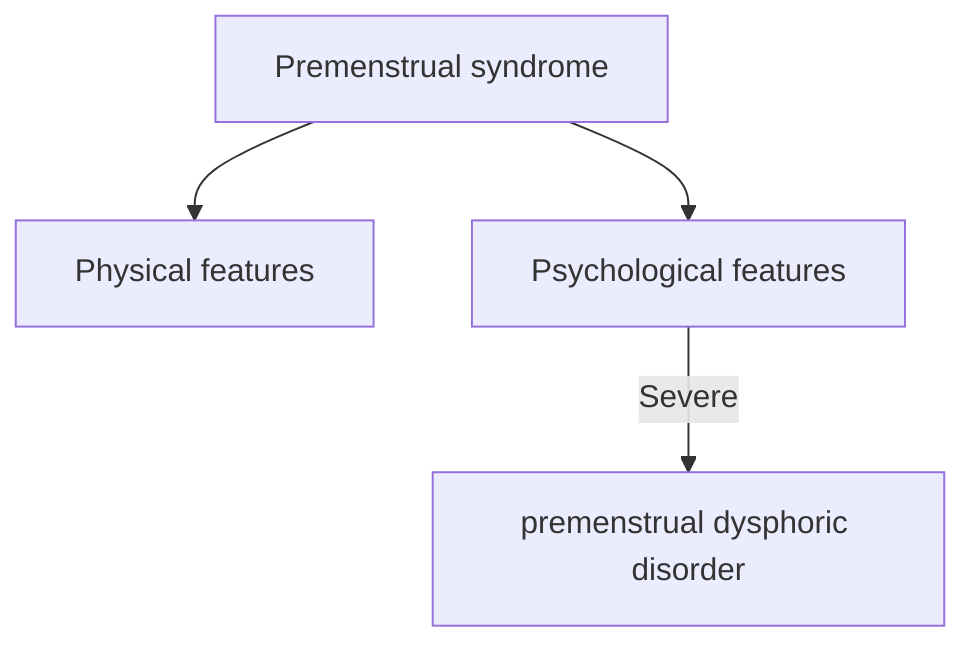

---
{"dg-publish":true,"permalink":"/notes-in-endocrinology/female-reproductive-endocrinology/other-topics-in-female-reproductive-endocrinology/premenstrual-syndrome-and-premenstrual-dysphoric-disorder/"}
---

- Credits
		- Section Writer:  Dr. Om J Lakhani 
		- Section Editor:  Dr. Om J Lakhani 
		

- Q. What are the components of  Premenstrual syndrome (PMS)?
    - Physical characteristics
    - Psychological characteristics
    - It must be severe enough to interfere with day to day life

- Q. When does  Premenstrual syndrome (PMS)  occur?
    - It occurs in the second half of the menstrual cycle

- Q. What is premenstrual dysphoric disorder?
    - Severe form of  Premenstrual syndrome (PMS)  in which psychological characteristics predominate 
    - Generally, if the symptoms are mainly behavioral/psychological- the diagnosis of PMDD is more likely than PMS 

- Q. Is it common for all women to experience some distress during this menstrual phase?
    - Yes
    - All women do experience some degree of discomfort
    - However, it should be labeled as PMS only if it is severe enough to cause economic and/or social dysfunction 

- Q. According to ACOG, what are the criteria for PMS?
    - 1. It should occur circa 5 days before the menstrual bleed (Luteal phase)
    - 2. Must last for 3 or more consecutive cycles
    - 3. Includes physical and psychological (behavioral) component
    - 4. Must be severe enough to cause economic and/or social dysfunction

- Q. What is the diagnostic criteria for PMS?
    - At least one each of the Physical or Behavioural symptoms listed below must be present 
    - Must be present at least 5 days before the menses 
    - And must be present for at least 3 consecutive cycles
    - Must be severe enough to cause economic and/or social dysfunction
    - Affective symptoms
        - Angry outbursts
        - Anxiety
        - Confusion
        - Depression
        - Irritability
        - Social withdrawal
    - Physical symptoms
        - Abdominal bloating
        - Breast tenderness or swelling
        - Headache
        - Joint or muscle pain
        - Swelling of extremities
        - Weight gain

- Q. What is the DSM-5 criteria for the diagnosis of PMDD?
    - Timing of symptoms
        - A) In the majority of menstrual cycles, at least 5 symptoms must be present in the final week before the onset of menses, start to improve within a few days after the beginning of menses, and become minimal or absent in the week post menses
    - Symptoms
        - B)One or more of the following symptoms must be present: 
            - 1) Marked affective lability (e.g., mood swings, feeling suddenly sad or tearful, or increased sensitivity to rejection)
            - 2) Marked irritability or anger or increased interpersonal conflicts
            - 3) Markedly depressed mood, feelings of hopelessness, or self-deprecating thoughts
            - 4) Marked anxiety, tension, and/or feelings of being keyed up or on edge
        - C) One (or more) of the following symptoms must additionally be present to reach a total of 5 symptoms when combined with symptoms from Criterion B above
            - 1) Decreased interest in usual activities
            - 2) Subjective difficulty in concentration
            - 3) Lethargy, easy fatigability, or marked lack of energy
            - 4) Marked change in appetite; overeating or specific food cravings
            - 5) Hypersomnia or insomnia
            - 6) A sense of being overwhelmed or out of control
            - 7) Physical symptoms such as breast tenderness or swelling; joint or muscle pain, a sensation of "bloating," or weight gain 
    - Severity
        - D) The symptoms are associated with clinically significant distress or interference with work, school, usual social activities, or relationships with others.
        - E) Consider Other Psychiatric Disorders The disturbance is not merely an exacerbation of the symptoms of another disorder, such as major depressive disorder, panic disorder, persistent depressive disorder (dysthymia) or a personality disorder (although it may co-occur with any of these disorders).
    - Confirmation of the disorder
        - F) Criterion A should be confirmed by prospective daily ratings during at least 2 symptomatic cycles (although a provisional diagnosis may be made prior to this confirmation). Exclude other Medical Explanations
        - G) The symptoms are not attributable to the physiological effects of a substance (e.g., drug abuse, medication, or other treatment) or another medical condition (e.g., hyperthyroidism).

- Q. Is there a genetic component of  Premenstrual syndrome (PMS)?
    - Yes, it is believed to be due to the involvement of the ESR1 gene - estrogen receptor alpha 1 gene

- Q. Biologically, what is the reason for PMS?
    - It occurs in the Luteal phase of the menstrual cycle
    - Earlier, it was believed to occur due to changes in the  estrogen and progesterone
    - However, it is now believed to occur because of changes in the neurotransmitter response (especially serotonin) in response to the hormones
    - Hence  SSRI  tend to be the most effective therapy for PMS 

- Q. Treatment with which vitamin is helpful in the management of PMS?
    - Vitamin B6

- **Clinical Features and diagnosis**

- Q. Which are the typical behavioral or psychological symptoms of PMS?
    - Mood swings and irritability are the most common behavioral symptom of PMS
    - Others include
        - anxiety/tension
        - sad or depressed mood
        - increased appetite/food cravings
        - sensitivity to rejection
        - diminished interest in activities

- Q. What are the physical manifestations of PMS?
    - The most common are abdominal bloating and extreme fatigue
    - The others are
        - breast tenderness
        - headaches
        - hot flashes
        - dizziness

- Q. Are hot flashes also seen?
    - Yes.
    - PMS is the most common cause of hot flashes outside of Perimenopausal syndrome
    - Hence this must be included in the differential diagnosis of Hot flashes 

- Q. Which endocrine disorder must be ruled out in patients with PMS?
    - Both hyperthyroidism and hypothyroidism need to be ruled out

- Q. How will you differentiate PMS from other mood disorders?
    - General mood disorder will occur irrespective of the menstrual cycle phase
    - PMS tends to occur mainly in the luteal phase
    - However, some mood disorders tend to worsen in the premenstrual/luteal period, and hence sometimes differentiation is difficult

- Q. At what age do these symptoms develop?
    - The symptoms of PMS can start right at the time of menarche and continue throughout the reproductive period, often ending during menopause
    - They are also more likely to have symptoms during the menopause transition
    - The symptoms may resolve during pregnancy as well. 

- Q. Is there any laboratory test for establishing the diagnosis of PMS?
    - No
    - However, a thyroid function test must be done to rule out thyroid dysfunction

- Q. Are the menstrual cycles regular in women with PMS?
    - They are generally normal
    - However, they are more likely to experience irregular menses during the menopause transition period 

- Q. What is the relation between OCP and PMS?
    - OCPs are sometimes used to treat PMS. However, they are not the first-line therapy
    - OCP can induce PMS like symptoms in some women

- Q. What questionnaire is used for diagnosis and monitoring of PMS?
    - Daily record of severity problem (DRSP) form 
    - {{pdf: https://firebasestorage.googleapis.com/v0/b/firescript-577a2.appspot.com/o/imgs%2Fapp%2FMedical_learning%2FC5eXKgIWhe.pdf?alt=media&token=dcb7c24a-b008-4fe0-bb3f-27a96caa0654}}

- Q. How is the DRSP used to make the diagnosis of PMS?
    - Record the score for each item 1 on each day using the following scale of 1 to 6: 1 = not at all, 2 = minimal, 3 = mild, 4 = moderate, 5 = severe, 6 = extreme.
    - Add the scores in the column for the first day of menses. If the total score is less than 50, consider a diagnosis other than premenstrual syndrome. 
    - If the total score is greater than 50, record two cycles of symptoms. 
    - If more than three items have an average score of more than 3 (mild) during the luteal phase, add the scores of five-day intervals during the luteal and follicular phases. 
    - A luteal phase score that is 30 percent greater than the follicular phase score indicates a diagnosis of premenstrual syndrome.

- Q. Enlist the differential diagnosis of PMS?
    - 1. Underlying mood disorder
    - 2. Hypothyroidism
    - 3. Hyperthyroidism
    - 4. Menopausal transition
    - 5. Substance abuse 

- **Treatment**

- Q. Broadly, what are the treatment options for PMS?
    - 1. Lifestyle measure
        - Stress reduction
        - Meditation
        - Exercise
    - 2.  SSRI 
    - 3.  OC pills (OCP) 
    - 4. GnRH agonist with hormone addback 

- Q. When are medicines given, and when are lifestyle measures alone considered?
    - Medications are given if the symptoms are severe enough to cause social and economic disturbances
    - Mild cases can be treated with lifestyle measures alone

- Q. How are the SSRI given in these cases?
    - The options for giving SSRI include:
        - 1. Daily
        - 2. Only during the luteal phase
            - Starting on day 14 of the menstrual cycle 
        - 3. On SOS basis 

- Q. What type of  OC pills (OCP)  are preferred in these cases?
    -  Drospirenone-containing OCP are preferred in cases of PMS
    - In India brands are CRISANTA, YAMINI (Drospirenone 3mg, ethinylestradiol 30mcg) etc
    - Brands containing a low dose of Ethinyl estradiol (EE) in the dose of 20 mcg may also be considered. (CRISTANTA-LS, YAMINI-LS)
    - OCP are second-line after SSRI and can be used in patients desirous of contraception and/or not responding to SSRI
    - Generally, a shorter interval period of 4 days instead of 7 days has been suggested for PMS 

- Q. What is done in severe cases not responding to the above therapies?
    - In severe cases, GnRH agonist therapy with adding back of hormones can be done

- Q. Which vitamin supplement is useful?
    - Vitamin B6 

- Q. Which herbal supplement is useful?
    - Vitex Agnus-Castus (Chasteberry)

- Q. Which SSRI can potentially cause weight gain?
    - Paroxetine 

- Q. Which drug of the above group can cause severe withdrawal symptoms?
    - Venlafaxine can cause withdrawal symptoms 
